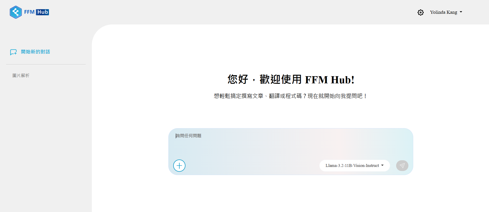

# **FFM Hub v0.2.0測試版操作說明**
## **產品簡介**
### **功能**概述
FFM Hub為一款地端GenAI推論軟體，易於下載部署各式繁中強化和開源模型，並區分系統管理員和一般使用者介面，便於企業內部管理及使用。
### 測試對象
一般中小型企業、新創公司、學校院所、公家機構、有隱私需求的單位。
### 測試目的
1\. 軟體安裝便利性：軟體安裝過程是否順利？耗時多久？

2\. 模型自助下載便利性：模型自助下載過程是否順利？耗時多久

3\. 使用者介面功能：使用者介面是否滿足使用者需求？

4\. 管理員介面功能：平台管理功能是否滿足使用者需求？

5\. 推論效能：模型推論效能是否滿足需求？是否有遇到等待時間過長等情形？

6\. 模型能力：模型推論時是否產生幻覺？模型能力是否滿足使用者需求？
## **操作說明**

### **系統管理員介面**
#### 初次登入設定
#### 模型管理
#### 使用者管理
### **一般使用者介面**
#### 初次登入設定
#### 模型推論
#### 系統提示詞
#### 歷史紀錄

